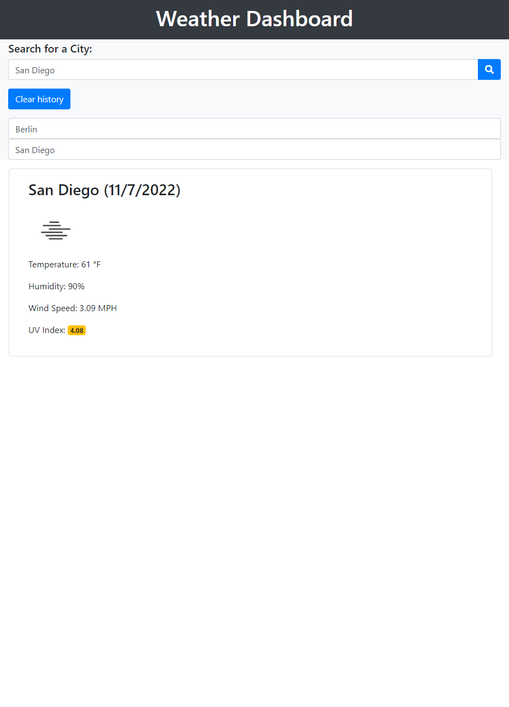

# Weather-Dashboard

## Project Description
 
 This is apps is designed to display the weather for any city the user searches while savings search history to local storage.  Current temprature is provided along with humidity, wind speed, and UV index. Website is also suppose to display a 5 day weather forcast. 

## Instructions

Search for the city that you would like to know the weather current weather in. You can select previously saved searches from history or clear history if desired. 

 ## Screenshot

 

 ## Link

https://irie-i.github.io/Weather-Dashboard/

